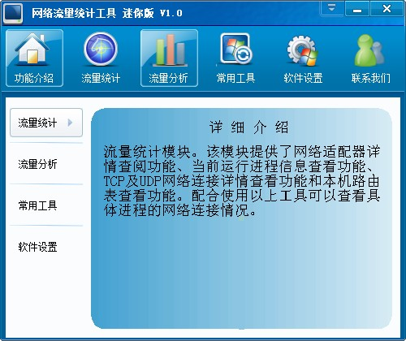
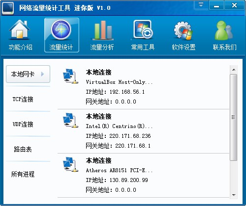
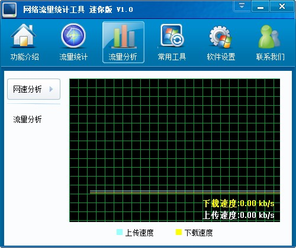
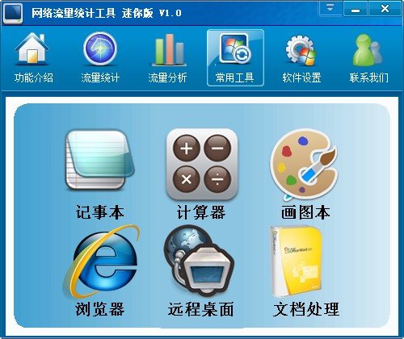
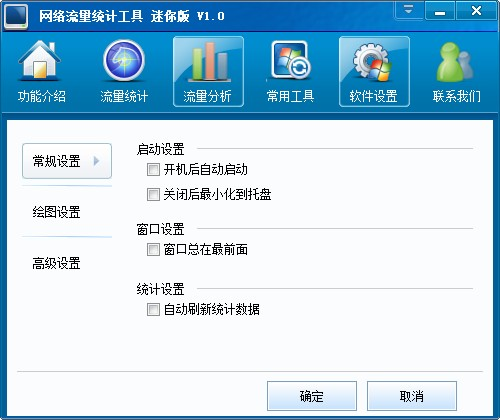
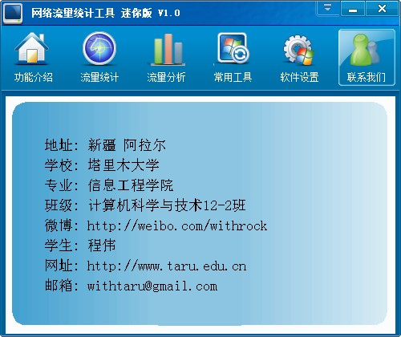

UseBkWin
===========

我欠群里的网友一份代码.

四年前，我还是一个为了毕业设计忙得焦头烂额的学生。

由于自己对编程的热爱，我想做一个牛逼闪闪的毕业设计，以此结束自己的大学时光。

在当时的背景下，金山公司的金山卫士非常流行，界面很绚丽。

当时刚开始流行搞开源，一些大公司陆续开放了一些自己使用的代码库，金山也不例外，开放了金山卫士的GUI库。

于是我决定利用他们开源的界面库(bkwin)，来做一个demo，用这个程序作为毕业设计。

虽然这个库很牛逼，做出来的东西很好看，但刚开始的时候，代码难免会有一些BUG，或者是自己的使用姿势不对，总是磕磕绊绊的。

后来，我加入了他们的开源代码讨论QQ群，把自己使用bkwin时遇到的问题发出来，抱着试试的心态，看能否得到解答。

没想到，大伙都很热情，对我这个还没毕业的小子，还算照顾。

好事多磨，最终，我终于做出了我的毕业设计，并顺利通过答辩。

在我答辩通过后，我也第一时间通知了群里的朋友，虽然彼此互不相识，但大家还是对我表示祝贺。

我想对他们说：谢谢你们！

我当时口头答应要把代码释放出来，但毕业后，自己忙着找工作，把这事给搁浅了。

四年过去了，自己现在也已经有了稳定的工作。由于工作基本上在*nix下工作，所以自己很久没写过windows的程序了，vs studio也卸载了,MSDN帮助文档也卸载了，连操作系统也不是windows了。

今天整理电脑里的资料，偶尔发现上面的这个截图.

虽然我写的代码很烂，不值什么钱，但我，欠群里朋友一个交代。

四年前自己熬夜写程序，写毕业论文，在vs studio里按F10 debug程序，在电脑前死死盯着屏幕等待群里朋友帮助的场景，一幕幕出现在脑海里。

四年里，自己忙着工作，忙着赚钱，忙着生活。不知群里的朋友们，你们过的好吗?

相关依赖
--------

* [wtl](http://wtl.sourceforge.net)
* [bkwin](http://code.ijinshan.com/index.html)
* [tinyxml](http://www.grinninglizard.com/tinyxml2/index.html)
* [vs studio 2008](https://www.microsoft.com/en-us/download/details.aspx?id=7873)

毕业设计文档
------------

* [毕业设计文档](毕业设计目录和正文.doc)

更多
-----

* [Fork Me](http://git.oschina.net/mktime/UseBkWin)

